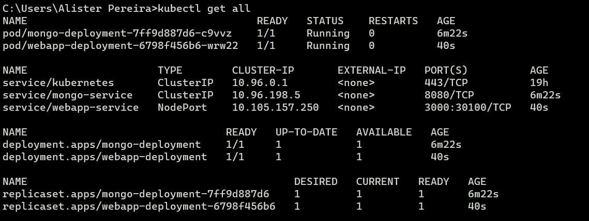
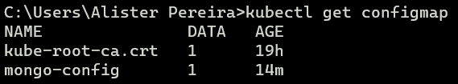
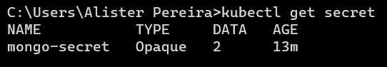
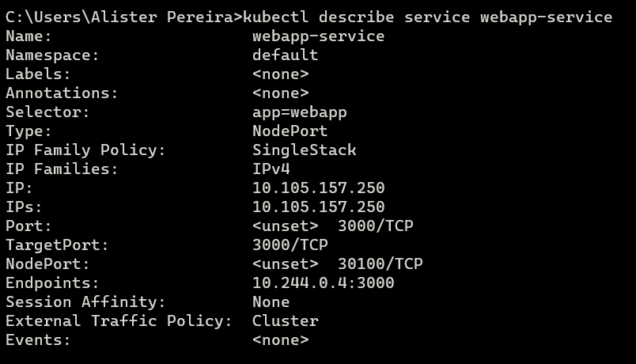
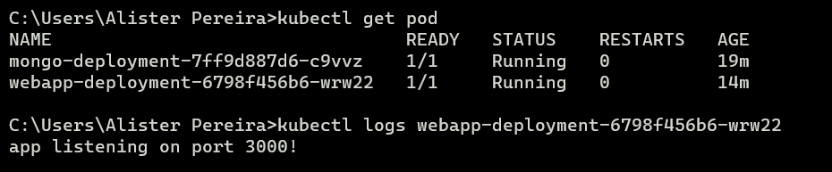
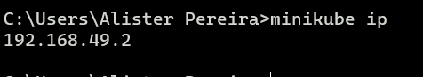

## Kubernetes

Node JS web app with mongo DB in one Pod

- Steps to start the application in the pod
    - Check ``kubectl get node`` or ``kubectl get pod``
    - Before we start the application we must apply the configuration & secret file
    - Run ``kubectl apply -f mongo-config.yaml``
    - Run ``kubectl apply -f mongo-secret.yaml``
- Now you need to start the database
    - Run ``kubectl apply -f mongo.yaml``
- Finally you can create the web application
    - Run ``kubectl apply -f webapp.yaml``

- Now we interact with the cluster
    - Run ``kubectl get all`` gets all the components created in the cluster

    

    - Run ``kubectl get configmap`` to get config map details

    

    - Run ``kubectl get secret`` to get secret details
    
    

- Get detailed information with describe
    - Run ``kubectl describe service webapp-service`` kubectl describe <resourceType> <resourceName>

    

- Get logs for a pod 
    - Run ``kubectl logs webapp-deployment-6798f456b6-wrw22`` or use ``-f`` to stream the logs

    

- Get service for a pod 
    - Run ``kubectl get svc`` or ``kubectl get service`` to see the services

    

- Get minikube ip address 
    - Run ``minikube ip`` to see the ip address

    

- Now run the app from the IP Address 192.168.12.2:30100 to see it

##### Reference
- https://www.youtube.com/watch?v=s_o8dwzRlu4